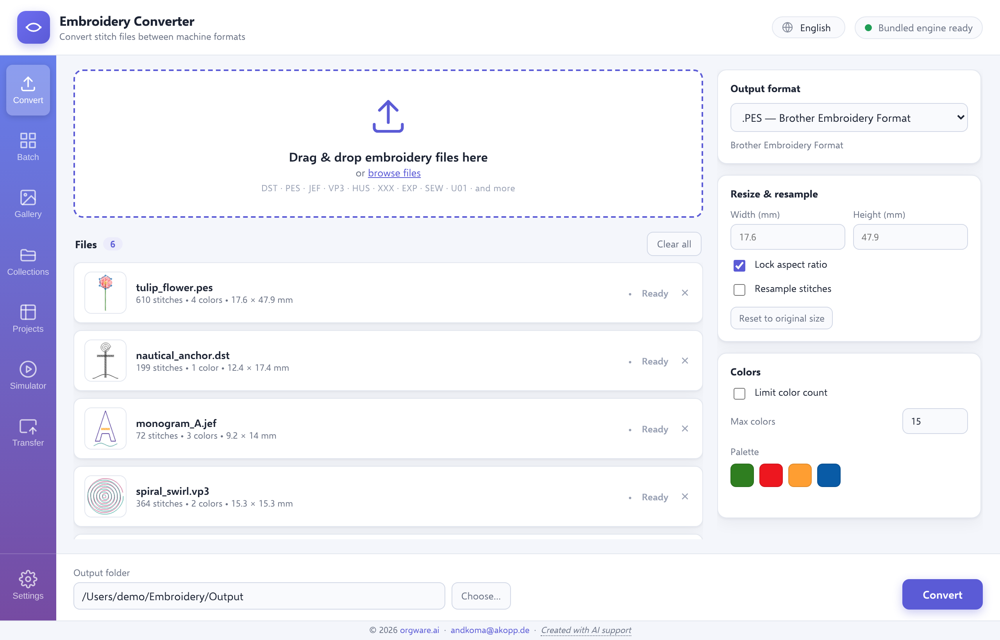
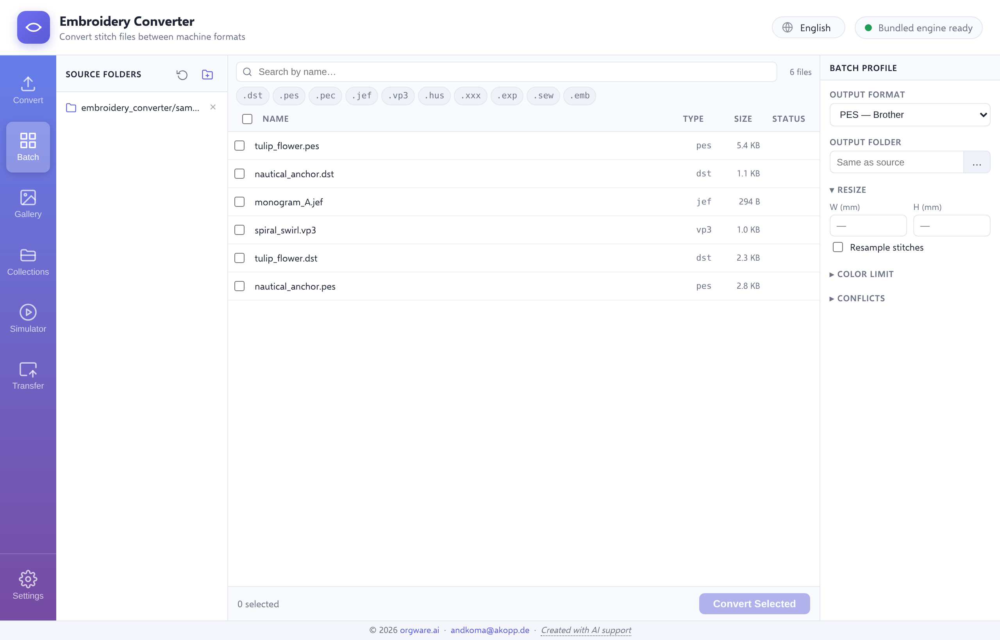
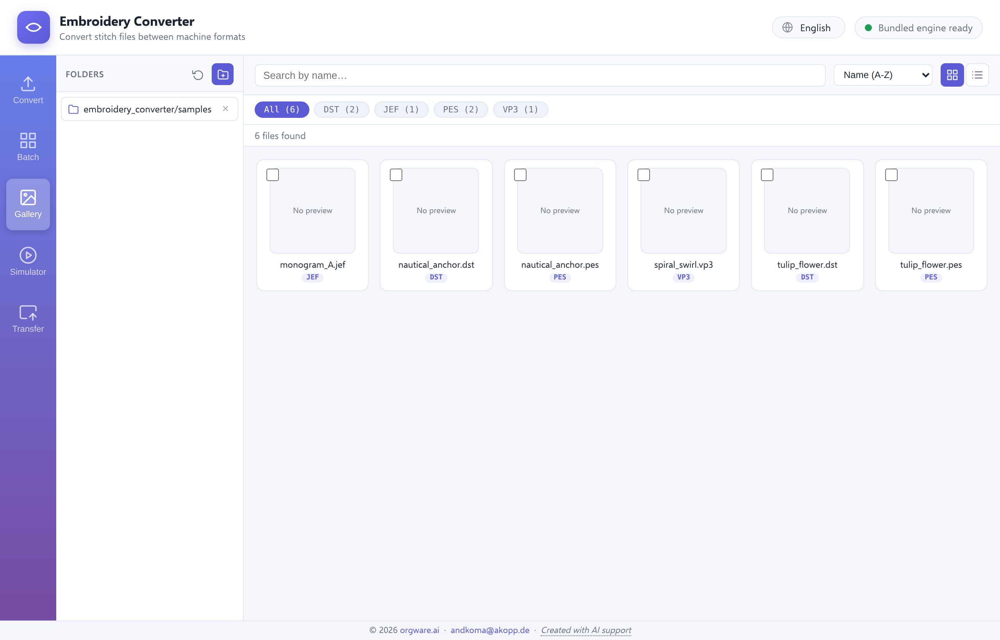
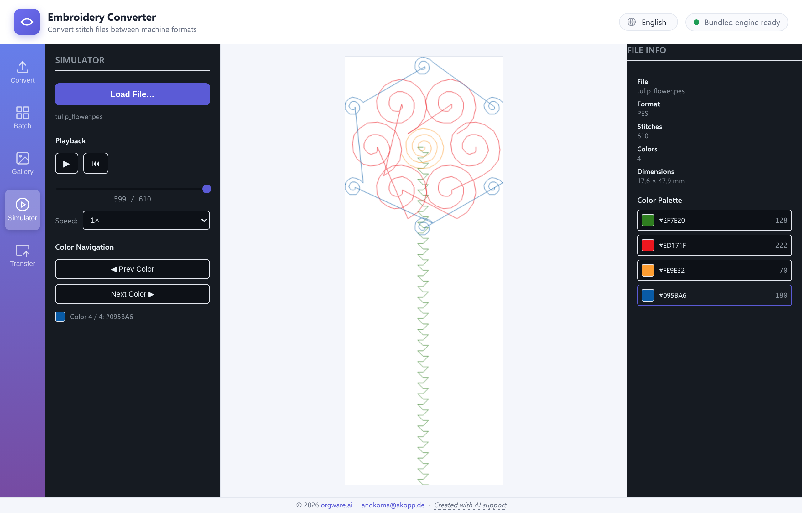
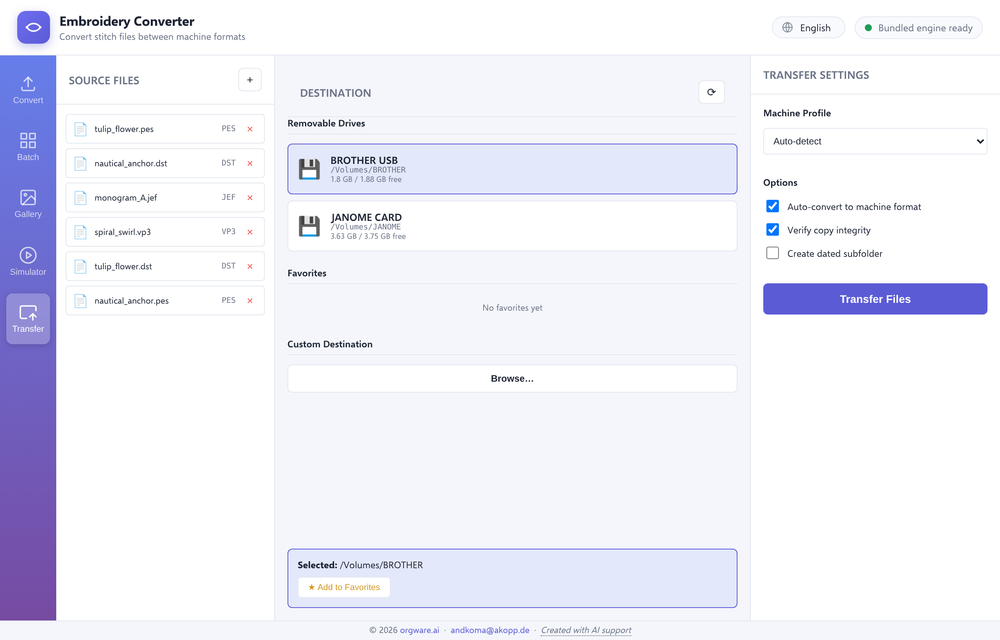
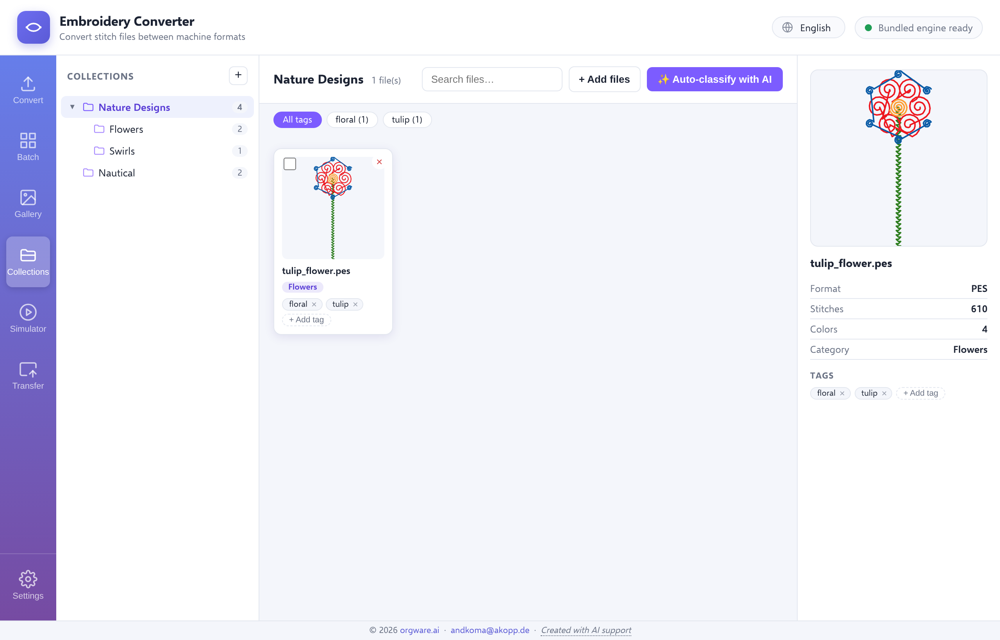
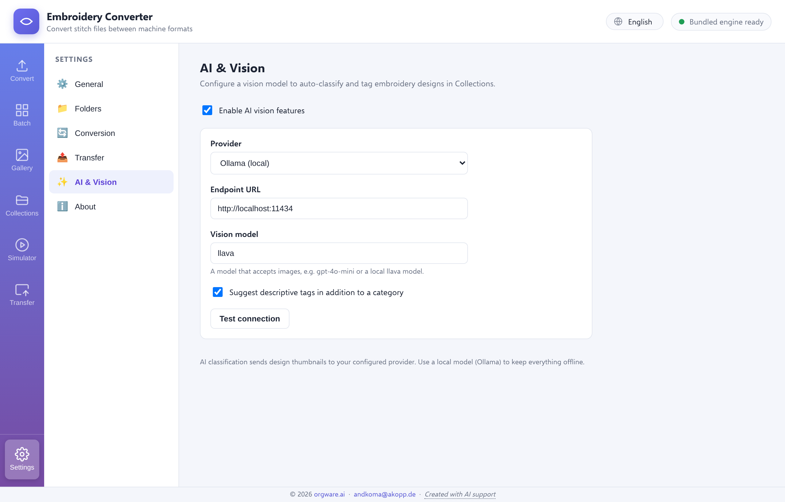

# 🧵 Embroidery Converter — Application Guide

**App Version:** 1.1.0 · **Author org:** orgware.ai ([andkoma@akopp.de](mailto:andkoma@akopp.de)) · *Created with AI support.*

A visual walkthrough of the **Embroidery Converter** desktop application — a
cross-platform **Electron** workstation for reading, converting, previewing and
transferring embroidery stitch files across 50+ machine formats. All conversion
is powered by the vendored, pure-Python
[`pyembroidery`](https://github.com/EmbroidePy/pyembroidery) engine (no `pip`
step required in packaged builds).

The app is organised as a **multi-panel workstation** with a left icon rail that
switches between seven purpose-built views that share one backend, one data model
and one settings store:

| View | Purpose |
|------|---------|
| **Convert** | Add a few files, tune per-file options, convert to a target format |
| **Batch** | Scan folders, filter/search, and convert many files with a shared profile |
| **Gallery** | File-manager-style browse of managed folders with previews & detail pane |
| **Simulator** | Animated stitch-by-stitch playback in real thread colors |
| **Transfer** | Copy (and auto-convert) designs to removable machine drives |
| **Collections** | Organize designs into nested collections with AI-powered classification |
| **Settings** | Manage AI providers, encrypted secrets, and application preferences |

The interface is fully translated into **English**, **Deutsch** and **Français**
(selectable from the top bar and remembered between sessions). The backend status
badge in the top-right corner reports engine readiness at a glance.

> All screenshots below are captured from the running app (headless Chromium via
> Playwright) using the real renderer and real backend data.

---

## 1. Convert



The **Convert** view is the classic single/few-file workflow. Drag & drop any
number of embroidery files onto the window (or browse), and each file is
inspected immediately:

- **Input preview thumbnails** — every added file shows a small vector preview of
  the actual stitches, rendered in its own thread colors, so you get visual
  feedback before converting.
- **Per-file metadata** — stitch count, color count and true dimensions in
  millimetres appear as soon as a file is dropped.
- **Target format selector** — choose the output format (PES, DST, JEF, VP3, EXP,
  XXX, PEC, U01, SVG, PNG, …); the writable set is queried live from
  `pyembroidery`.
- **Format-specific options** — cap the number of color blocks for formats with
  limited color slots, inspect/edit the thread palette, and resize with optional
  **stitch resampling** so stitch *density* is preserved rather than simply
  stretching coordinates.
- **Output folder** selector, **Convert** button, progress bar and per-file
  status icons (pending / converting / done / error) with conversion warnings.

---

## 2. Batch



The **Batch** view scales the same conversion engine up to whole folders:

- **Add folders** and scan them (optionally recursively) via a streaming NDJSON
  backend, so even large libraries populate progressively.
- **Virtualized file table** listing every file with its type, size and metadata —
  fast even with thousands of rows.
- **Filter & search** to narrow the working set, plus per-row selection.
- **Batch profile** panel — set a shared target format and conversion options once
  and apply them across all selected files, while still allowing per-file
  overrides.
- **Progress reporting** with per-file status and conversion warnings, writing to
  a chosen output folder (including a mounted or network-share path).

---

## 3. Gallery



The **Gallery / Explorer** is a file-manager-style browser for your managed
embroidery folders:

- **Managed folders** list on the left (add/remove, persisted between sessions).
- **Thumbnail grid** with lazy, viewport-aware loading (IntersectionObserver), so
  previews render only as they scroll into view.
- **Extension filter chips** (DST / JEF / PES / VP3 …), a search bar and sort
  options (name / size / stitches).
- **Detail pane** on the right showing a large preview of the selected design with
  its metadata (stitches, colors, dimensions) and **hand-off actions** — send the
  file straight to Convert, Batch, Simulator or Transfer, or reveal it in the
  system file manager.

---

## 4. Simulator



The **Stitch Simulator** renders a design stitch-by-stitch on an HTML5 canvas in
its real thread colors, so you can preview exactly how a machine will sew it:

- **Load a file** directly, or hand one off from the Gallery.
- **Playback controls** — Play/Pause, Reset, a timeline scrubber to jump to any
  stitch position, and an adjustable **speed** selector (0.5×–10×).
- **Color navigation** — jump between color blocks with Prev/Next buttons, with a
  live indicator of the current color block and its hex value.
- **File info panel** — format, stitch count, color count, dimensions and the full
  **color palette** with per-color stitch counts.

The animation engine uses `requestAnimationFrame` with an adjustable
stitches-per-second rate for smooth playback at any speed.

---

## 5. Transfer



The **Machine Transfer** view copies finished designs to embroidery machine media
(USB carriers, cards and shares that mount as a filesystem):

- **Source files** panel — add the designs you want to transfer.
- **Destination picker** — auto-detected **removable drives** (e.g. BROTHER /
  JANOME cards with free-space readouts), saved **favorites**, or any **custom
  path** via Browse.
- **Machine profile** database (Brother, Janome, Pfaff, Husqvarna, Singer, Toyota,
  Melco, Tajima, Generic) with format validation and color-limit awareness, plus
  an **Auto-detect** option.
- **Transfer options** — **auto-convert to the machine's format**, **verify copy
  integrity** (size comparison), and optionally **create a dated subfolder**.
- Sequential copy with progress updates and verification, so files land in a form
  the target machine can actually read.

---

## 6. Collections



The **Collections** view provides a powerful organization system for your
embroidery design library:

- **Nested tree structure** with unlimited depth — create collections and
  sub-collections to organize designs hierarchically (e.g. "Nature → Flowers →
  Roses").
- **Drag-and-drop organization** — move files between collections and reorder the
  tree structure intuitively.
- **Manual classification** — assign each design to a category and add descriptive
  tags for filtering.
- **AI-powered auto-classification** — let a vision model (OpenAI, Ollama, or any
  OpenAI-compatible endpoint) analyze design thumbnails and suggest categories +
  tags automatically. Respects provider capabilities (vision on/off) and
  functional allowances (autoClassify permission).
- **Tag-based filtering** — click tag chips to instantly filter the file grid to
  matching designs.
- **Search** — find designs by name across all collections.
- **File inspector** — select any design to see its preview, metadata, category,
  and tags; edit classifications inline.

Collections data is stored in `userData/collections.json` and persists across
sessions. The AI classification feature requires an AI provider to be configured
in Settings.

---

## 7. Settings



The **Settings** panel provides centralized configuration across six topics:

### General
- **Language** — choose between English, Deutsch, or Français (applied
  app-wide and remembered between sessions).
- **Theme** — light theme (currently the only option).

### Folders (Managed Folders)
- Add/remove folders used by Gallery and Batch views.
- Configure recursive scanning and assign custom aliases (e.g. "Client Work"
  instead of `/Users/me/Embroidery/Clients`).
- Editable inline by double-clicking folder labels.

### Conversion (Batch Defaults)
- **Default format** — the output format preset for Batch conversions (DST, PES,
  JEF, etc.).
- **Resample** — whether to resample stitches when resizing (boolean).
- **Color limit** — maximum thread colors (null = no limit).
- **Conflict strategy** — filename conflict handling: `suffix` (add number) or
  `overwrite`.

### Transfer (Favorite Destinations)
- Quick-access destinations for copying files to USB drives or network shares.
- Add/remove/edit favorite paths with custom labels (e.g. "Brother USB").

### AI & Vision
- **Multi-provider registry** — add, configure, and manage multiple AI providers
  (OpenAI, OpenAI-compatible, Ollama, LM Studio).
- **Per-provider configuration:**
  - **Kind** (determines API contract and whether a key is required)
  - **API base URL** (custom endpoints supported)
  - **Model** (e.g. `gpt-4o-mini`, `llava`)
  - **Capabilities** (vision / chat / embeddings toggles)
  - **Functional allowances** (autoClassify, sendExternal for privacy control)
- **Encrypted secrets store** — API keys and tokens are encrypted via Electron
  `safeStorage` (OS keychain: macOS Keychain / Windows DPAPI / Linux libsecret)
  and stored in `userData/secrets.enc` (mode `0600`). Plaintext secrets **never**
  cross back to the renderer — only `{isSet, last4, protected}` status is exposed.
- **Conditional secret fields** — the API key field is shown/collected/transmitted
  **only** for provider kinds that use keys (OpenAI, OpenAI-compatible). Local
  runtimes (Ollama, LM Studio) never show a key field or send an `Authorization`
  header.
- **Active provider selection** — choose which provider powers AI classification
  in Collections.
- **Per-provider test** — validate connectivity and model availability for each
  configured provider.
- **Auto-tag** toggle — whether AI classification should suggest descriptive tags
  in addition to categories.

### About
- Application name, version, copyright (© 2026 orgware.ai), author, website,
  license, and AI transparency notice.

All settings are persisted to `userData/settings.json` and restored on app
startup. Secrets are stored separately in an encrypted file and never appear in
plaintext in settings.

---

## Supported formats

- **Read:** DST, PES, PEC, JEF, VP3, HUS, XXX, EXP, SEW, U01, TAP, PHB, PHC, BRO,
  DAT, DSB, DSZ, EMD, 10O, 100, SHV, KSM, MAX, JPX, TBF, GT, INB, ZXY, CSV, JSON,
  GCODE and more.
- **Write:** PES, DST, JEF, VP3, EXP, XXX, PEC, U01, TBF, PMV, CSV, JSON, GCODE,
  SVG, PNG (writable set queried live from `pyembroidery`).

> **Format notes:** DST / EXP / TAP store no thread color information — colors are
> dropped when writing to these formats (the app warns you). Color reduction
> merges removed color blocks into the preceding block. Resampling subdivides long
> stitch segments created by up-scaling so stitch density stays close to the
> original.

---

## Reproducing the screenshots

The screenshots in this guide are generated with a Playwright harness that loads
the **real** renderer (`renderer/index.html`) and feeds it **real** backend data
(formats + per-file `inspect` output produced by `scripts/convert.py`):

```bash
pip install playwright
playwright install chromium
python3 scripts/make_screenshots.py
# → writes docs/screenshots/01-convert.png … 05-transfer.png
```

---

## License & credits

MIT — Copyright © 2026 **[orgware.ai](https://orgware.ai)** —
[andkoma@akopp.de](mailto:andkoma@akopp.de)

- 📖 [Architecture & design plan](./ARCHITECTURE.md)
- 📥 [Downloads & installation](./DOWNLOADS.md)
- 📋 [License & third-party attributions](./LICENSES.md)

> **EU AI Act Transparency Notice:** This application was developed with AI
> support, in accordance with EU AI Act transparency requirements.
